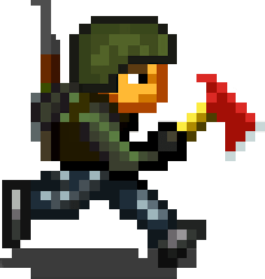

# MiniDayZ

#### What is this?
This is a browser version of the game [MiniDayZ](https://minidayz.com/ "Mini DAYZ | Official website") by [Bohemia Interactive](https://www.bohemia.net/ "Bohemia Interactive"). 
A browser version *was* officially available, but unfortunately, for [reasons](https://minidayz.com/blog/mini-dayz-browser-version-will-no-longer-be-supported ), it is [no longer available](https://minidayz.com/game ":[") (and it even had multiplayer!). 
To be clear, **aside from this readme, none of the content on this repository is mine**. The moment Bohemia Interactive tells me to take this down, I will.

#### How do I play?
The link is in the description of this repository, but here it is again. [MDZ](https://matterhorn56.github.io/MiniDayZ/ "Mini DAYZ")
* As far as I know, game progress is saved locally; a playthrough can be resumed from the same device.
* Touch devices are untested, and the app *is* **much** better in terms of performance, support, features (watch ad to get lootbox), etc.
  * [Apple](https://itunes.apple.com/ca/app/mini-dayz-survival-game/id1141343378 "Apple/iOS")
  * [Android](https://play.google.com/store/apps/details?id=com.bistudio.minidayz "Android")

#### How did you do this?
After a little research, I found that the Android version of the game uses the Cordova framework. From there, extracting the .apk and utilizing Cordova CLI (Command Line Interface) enabled me to build the app for Windows (Linux and Mac are possible this way too!). I played this for a while and decided to port it to Chrome as an app, but ultimately I found that hosting the index.html in the www folder from the extracted apk was a better idea (no install, accessible anywhere, anyone can play). Github Pages was a pretty good way to host this, and here it is. 

:]

#### To Bohemia Interactive
"Unfortunately we regret to inform you that we're no longer able to create further updates for Mini DAYZ's browser version. The main reason for this is that we need to turn our attention to other upcoming projects and pick our priorities accordingly."

I think that means you didn't have enough time to split between browser and mobile. Hopefully that means you're alright with this existing.
If you are opposed to the idea of letting this exist, don't even bother obtaining a DMCA Takedown Notice. Just open an issue on this and I will close this repository immediately.
